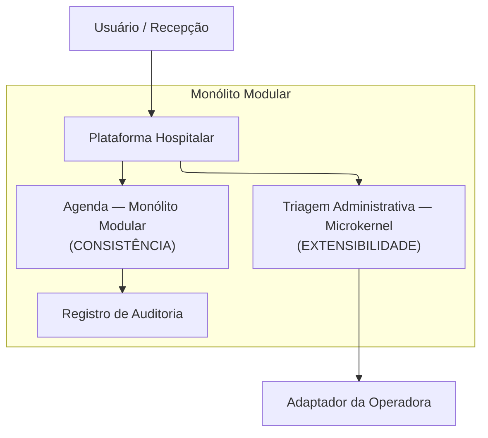

# Estudo de caso: plataforma hospitalar

**Arquitetura de Software — Módulo 1**
Autor: Davy Woolley

Este documento reúne os quatro exercícios do estudo de caso: os cenários que
dizem o que importa, a matriz que compara os estilos, a estrutura escolhida e o
registro da decisão.

---

## Exercício 1 — Cenários

Três capacidades vivem na mesma plataforma e pedem coisas diferentes.

| Capacidade             | Força dominante |
| ---------------------- | --------------- |
| Agenda                 | consistência    |
| Triagem administrativa | extensibilidade |
| Faturamento            | vazão           |

Os três cenários abaixo foram executados no laboratório, no mesmo ambiente:
banco PostgreSQL local e massa sintética gerada com semente fixa.

### Cenário 1 — Agenda

- **Fonte:** duas recepcionistas, em terminais diferentes
- **Estímulo:** 50 pedidos do mesmo horário em menos de 1 segundo
- **Ambiente:** operação normal, sob 100 reservas/s
- **Artefato:** módulo Agenda
- **Resposta:** uma reserva confirmada; as outras recebem recusa por conflito, com o protocolo da vencedora
- **Medida:** 0 duplicadas em 1.000 tentativas concorrentes, p95 até 300 ms

**Resultado:** 0 duplicadas em 1.000 tentativas, p95 de 190 ms.
**Como medimos:** script de carga em k6 dispara as tentativas; a contagem de
duplicadas sai de uma consulta que agrupa por profissional e horário e procura
contagem maior que um.

### Cenário 2 — Triagem administrativa

- **Fonte:** equipe de TI de uma unidade
- **Estímulo:** pedido para acrescentar uma etapa nova de coleta ao pré-atendimento
- **Ambiente:** evolução, sem parada programada
- **Artefato:** módulo Triagem e seu contrato de plugin
- **Resposta:** a etapa entra como extensão e liga ou desliga por configuração, por unidade
- **Medida:** 0 arquivos do núcleo alterados e testes do núcleo passando sem edição

**Resultado:** a extensão do questionário da unidade Norte entrou sem tocar em
nenhum arquivo do núcleo, e os testes do núcleo passaram sem edição.
**Como medimos:** `git diff --stat` da branch da extensão, conferindo que nada
sob `triagem/nucleo/` aparece, mais a suíte de testes antes e depois.

### Cenário 3 — Faturamento

- **Fonte:** rotina de fechamento diário
- **Estímulo:** lote de 10.000 registros vindos de três origens
- **Ambiente:** operação normal, janela noturna
- **Artefato:** capacidade Faturamento
- **Resposta:** o lote é validado, normalizado, correlacionado e entregue por parceiro; cada rejeição sai com etapa, motivo e correlação
- **Medida:** pelo menos 500 registros/s e lote concluído em até 20 s

**Resultado:** 600 registros/s, lote fechado em 17 s. Das 10.000 linhas, 150
foram rejeitadas, todas com etapa e motivo preenchidos.
**Como medimos:** massa gerada por `gerar_massa.py` com semente fixa; o próprio
pipeline informa registros/s e rejeições por etapa ao final.

As demais capacidades do caso não têm cenário próprio aqui. Cadastro,
elegibilidade e autorização estão dentro da triagem; auditoria aparece na
estrutura do Exercício 3.

---

## Exercício 2 — Matriz de estilos

| Estilo                | Agenda                                                                                                  | Triagem administrativa                                                      | Faturamento                                                                    |
| --------------------- | ------------------------------------------------------------------------------------------------------- | --------------------------------------------------------------------------- | ------------------------------------------------------------------------------ |
| **Camadas**           | separa entrada, aplicação, regra e persistência, mas cada regra nova atravessa quatro níveis            | separa coleta, regra e integração, mas uma etapa nova toca as três camadas  | testa validação sem infraestrutura, mas o lote não tem forma natural em níveis |
| **Pipes and filters** | ruim: a reserva é uma decisão única, não uma sequência; espalhar isso entre filtros perde a atomicidade | organiza etapas lineares, mas etapas opcionais viram desvios dentro do tubo | ótimo: cada filtro faz uma coisa e dá para medir vazão por etapa               |
| **Microkernel**       | só compensaria se as regras de reserva variassem por unidade; hoje não variam                           | encaixa direto: núcleo estável e etapas opcionais por unidade               | isola layouts de parceiro, mas não organiza o miolo do lote                    |
| **Monólito modular**  | mantém a reserva como transação local em um banco só                                                    | dá fronteira clara, mas precisa de um estilo interno para as etapas         | mantém os módulos perto, mas o lote disputa CPU com a agenda                   |

Duas células não davam para decidir só lendo, então medimos:

- **Monólito modular × Faturamento:** rodamos o lote e a carga da agenda ao mesmo tempo. O p95 da agenda subiu de 190 ms para 270 ms — dentro do limite de 300 ms, mas com pouca folga.
- **Microkernel × Triagem:** a extensão piloto rodou só pelo contrato, sem alterar o núcleo e sem acessar o banco dele.

**Qual capacidade separa mais os estilos.** A agenda. Faturamento aceita bem
tanto pipes and filters quanto camadas, e a escolha entre os dois é de
conveniência. Já a reserva concorrente descarta candidatos: pipes and filters
quebra a decisão que precisa ser atômica, e microkernel acrescenta indireção sem
resolver o conflito. Sobra a consistência local, que o monólito modular entrega
do jeito mais simples.

---

## Exercício 3 — Estrutura

Escolhemos um **monólito modular**: uma implantação, um banco. A Agenda fica
como módulo do próprio monólito, sem estilo interno extra, porque a consistência
vem da transação local. A Triagem é um **microkernel**, com núcleo estável e
extensões por unidade. A Agenda grava no Registro de Auditoria. O acesso à
operadora fica atrás de um adaptador, fora da plataforma.

**Texto alternativo:** o bloco "Usuário / Recepção" aponta para "Plataforma
Hospitalar". Dentro do quadro "Monólito Modular", a Plataforma Hospitalar aponta
para "Agenda — Monólito Modular (CONSISTÊNCIA)" e para "Triagem Administrativa —
Microkernel (EXTENSIBILIDADE)", e a Agenda aponta para o "Registro de
Auditoria". Fora do quadro, a Triagem aponta para o "Adaptador da Operadora".

**Figura 1 — Estrutura inicial da plataforma hospitalar.**

**Leitura textual da figura:** o Usuário/Recepção chega à Plataforma
Hospitalar, que é a porta de entrada. Dentro do quadro "Monólito Modular", uma
implantação única, a Plataforma encaminha o pedido para a Agenda ou para a
Triagem Administrativa. A Agenda grava no Registro de Auditoria, também dentro
do quadro. Saindo do quadro, a Triagem alcança o Adaptador da Operadora, que
está fora da plataforma e traduz o modelo interno para o protocolo da operadora.

**Cada módulo e o cenário que o justifica:**

- **Agenda**, sem estilo interno extra — cenário 1. A reserva é uma transação local, e é isso que garante uma confirmação e 49 conflitos em 50 tentativas.
- **Triagem**, microkernel — cenário 2. As etapas que variam por unidade entram como extensão, ligadas por configuração.
- **Registro de Auditoria** — rastreabilidade. Recebe da Agenda o fato mínimo com a chave de correlação, não o conteúdo sensível.

O adaptador e a operadora estão fora do quadro porque são externos. O
Faturamento não aparece na figura: pela medição do Exercício 2 ele caberia
aqui, mas com pouca folga, então não fixamos ainda onde ele vai morar.

---

## Exercício 4 — ADR-001: estrutura inicial

**Estado:** aceito · **Data:** 22 de agosto de 2026 · **Autor:** Davy Woolley

### Contexto

A plataforma cuida da parte administrativa da jornada do paciente. Três forças
puxam para lados diferentes: a agenda precisa de consistência, a triagem precisa
de extensibilidade e o faturamento precisa de vazão. Não temos equipes separadas
por capacidade nem exigência de implantar cada uma no seu ritmo.

### Alternativas descartadas

- **Aplicação única sem módulos** — seria mais simples de operar, mas sem fronteira qualquer regra alcança o modelo da outra. Descartada porque não dá para verificar "0 arquivos do núcleo alterados" quando não existe núcleo.
- **Microkernel como estrutura global** — daria extensibilidade em tudo, mas o contrato de plugin ficaria genérico demais para caber numa reserva atômica e num lote de 10.000 registros. Descartada porque só a triagem varia por unidade.
- **Camadas dentro da Agenda** — separaria bem as responsabilidades, mas acrescenta quatro níveis num caminho que precisa ser curto. Descartada porque a consistência vem do banco, não do arranjo interno.
- **Um serviço por capacidade** — daria escala e falha isoladas, mas exigiria coordenação distribuída justo na reserva concorrente. Descartada porque o p95 da agenda ficou em 270 ms mesmo durante o lote pesado: não há ganho que pague a coordenação hoje.

### Decisão

Monólito modular, na forma da Figura 1: Agenda e Triagem numa implantação só,
Agenda gravando na Auditoria, operadora atrás de um adaptador. O Faturamento
fica de fora da estrutura inicial por enquanto.

### Consequências

**A favor:** garantir "nunca duas reservas no mesmo horário" fica fácil, porque
é uma transação local. Medimos 0 duplicadas em 1.000 tentativas.

**A favor:** a Triagem ganha etapas novas por configuração, sem nova implantação.

**Contra, e aceitamos:** todos os módulos dividem processo, escala e falha.
Durante o lote pesado o p95 da agenda vai a 270 ms, com 30 ms de folga para o
limite de 300 ms.

**Contra, e aceitamos:** a figura cobre duas das três capacidades e não diz onde
o Faturamento vive.

**Contra, e aceitamos:** fronteira de módulo é convenção, não barreira. Só um
teste de dependências garante que ninguém atravessou.

**Contra, e aceitamos:** só a Agenda alimenta a Auditoria nesta versão. A
Triagem vai precisar emitir fatos próprios quando a jornada inteira tiver que
ser reconstruída.

### Evidências

| Evidência                    | Resultado                                          | Onde repetir                                    |
| ---------------------------- | -------------------------------------------------- | ----------------------------------------------- |
| Reserva concorrente          | 0 duplicadas em 1.000, p95 190 ms                  | script k6 e consulta por profissional e horário |
| Extensão piloto da Triagem   | 0 arquivos do núcleo alterados                     | `git diff --stat` da branch e suíte do núcleo   |
| Lote de 10.000 registros     | 600 registros/s, 17 s, 150 rejeições identificadas | `gerar_massa.py` com semente fixa               |
| Lote e agenda ao mesmo tempo | p95 da agenda de 190 ms para 270 ms                | os dois cenários no mesmo ambiente              |
| Fronteira entre módulos      | nenhuma dependência fora das interfaces            | verificação de imports entre pacotes            |

### Quando revisar

1. Se o p95 da agenda passar de 500 ms em duas medições na mesma semana.
2. Se o lote deixar de fechar em 5 minutos por três dias seguidos — é este o gatilho que decide se o Faturamento entra no monólito ou nasce separado.
3. Se alguma extensão da Triagem precisar mexer no núcleo ou no banco dele.
4. Se a Triagem passar a precisar de rastreabilidade própria: a figura ganha uma segunda seta para a Auditoria.
5. Se aparecer exigência de implantar capacidades em ritmos diferentes, com equipes separadas.
