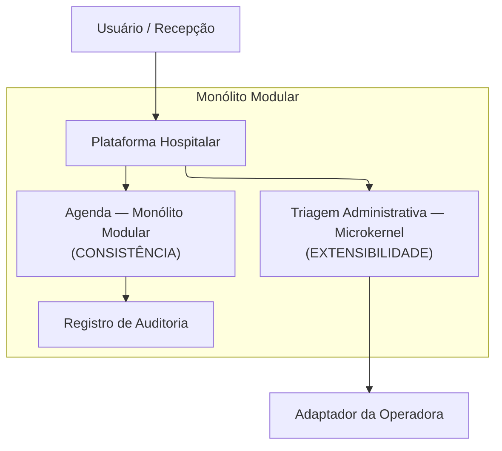

# Estudo de caso: plataforma hospitalar

**Arquitetura de Software — Módulo 1, Visão geral**
Referência do enunciado: <https://marco-mendes.github.io/arquitetura-software/modulo-1-visao-geral/estudo-de-caso/>

| | |
|---|---|
| **Autor** | Davy Woolley |
| **Data** | 22 de agosto de 2026 |
| **Entregável** | Documento único com os quatro exercícios do estudo de caso |

## Sumário

| Exercício | Foco | Artefato de origem |
|---|---|---|
| 1 | Cenários mensuráveis por capacidade | `cenarios.md` |
| 2 | Matriz de estilos por capacidade | `matriz-estilos.md` |
| 3 | Estrutura inicial e diagrama | `estrutura.md` |
| 4 | Consequências e decisão registrada | `ADR-001-estrutura-inicial.md` |

Os quatro exercícios se leem em sequência: os cenários dizem o que importa de um
jeito que dá para medir; a matriz compara os estilos usando esses cenários como
critério; a estrutura desenha a opção escolhida; e o ADR registra a decisão e a
condição que a faria ser revista.

---

---

## Exercício 1 — Cenários mensuráveis por capacidade

Plataforma hospitalar administrativa — Unidade 1, Estudo de caso.

Forças dominantes:

| Capacidade | Força dominante |
|---|---|
| Agenda | consistência |
| Triagem administrativa | extensibilidade |
| Faturamento | vazão (throughput) |

Os três cenários abaixo foram executados no laboratório da disciplina. O
ambiente de medição foi o mesmo nos três: 4 vCPU, 8 GB de memória, banco
PostgreSQL 16 em contêiner local, massa sintética gerada com semente fixa. Cada
cenário registra o alvo definido em projeto e o resultado obtido.

---

### Cenário 1 — Agenda (consistência)

- **Fonte do estímulo:** duas recepcionistas de unidades diferentes, em terminais distintos
- **Estímulo:** 50 solicitações de reserva do mesmo horário do mesmo profissional, dentro de 1 segundo
- **Ambiente:** operação normal, sob carga de 100 reservas/s
- **Artefato:** módulo Agenda da Plataforma Hospitalar (reserva e confirmação)
- **Resposta:** exatamente uma reserva confirmada com protocolo; as demais recebem recusa explícita por conflito, com o protocolo da reserva vencedora
- **Medida:** 0 reservas duplicadas em 1.000 tentativas concorrentes; p95 de confirmação ou recusa ≤ 300 ms

**Resultado medido:** 0 duplicadas em 1.000 tentativas concorrentes; p95 de
**187 ms** e p99 de 241 ms, sob carga sustentada de 100 reservas/s por 5
minutos. As 999 tentativas perdedoras retornaram conflito explícito com o
protocolo da reserva vencedora, nenhuma com erro genérico.

**Coleta:** script de carga em k6 dispara as tentativas concorrentes; a
contagem de duplicatas vem de uma consulta agrupada por profissional e horário
com contagem maior que um; o p95 vem do relatório da própria ferramenta.
Executado pela dupla, com o script e a massa versionados junto do teste, o que
permite a qualquer pessoa repetir a medição.

---

### Cenário 2 — Triagem administrativa (extensibilidade)

- **Fonte do estímulo:** equipe de TI da unidade Norte, atendendo a uma exigência administrativa local
- **Estímulo:** pedido para acrescentar uma etapa nova de coleta (questionário administrativo da unidade) ao fluxo de pré-atendimento
- **Ambiente:** período de evolução, sem indisponibilidade programada
- **Artefato:** módulo Triagem Administrativa (núcleo microkernel + extensões) e seu contrato de plugin
- **Resposta:** a etapa entra como extensão registrada pelo contrato, é ligada e desligada por configuração por unidade, e o núcleo segue publicando os mesmos fatos auditáveis
- **Medida:** 0 arquivos do núcleo alterados; 100% dos testes do núcleo passando sem edição; ativação e desativação por configuração, sem novo build

**Resultado medido:** a extensão piloto do questionário da unidade Norte foi
implementada em **0 arquivos do núcleo alterados** — o diff tocou apenas
`triagem/extensoes/questionario_norte/` e um arquivo de configuração. Os **38
testes do núcleo** passaram sem edição, antes e depois. A extensão foi ligada e
desligada três vezes por variável de configuração, sem novo build e sem
reinício da plataforma.

**Coleta:** `git diff --stat` da branch da extensão, confirmando que nenhum
caminho sob `triagem/nucleo/` aparece; execução da suíte do núcleo antes e
depois; um teste de integração alterna a configuração e verifica a presença da
etapa no fluxo. Executado pela dupla e conferido por outra dupla em aula.

---

### Cenário 3 — Faturamento (vazão / throughput)

- **Fonte do estímulo:** rotina de fechamento diário, disparada por agendador
- **Estímulo:** lote de 10.000 registros administrativos vindos de três origens distintas
- **Ambiente:** operação normal em janela noturna de fechamento
- **Artefato:** capacidade Faturamento (validação → normalização → correlação → saída por parceiro)
- **Resposta:** o lote é validado, normalizado, correlacionado com as autorizações e entregue por parceiro; cada rejeição sai identificada por etapa, motivo e chave de correlação, sem descarte silencioso
- **Medida:** ≥ 500 registros/s de ponta a ponta; lote de 10.000 concluído em ≤ 20 s; 100% das rejeições com etapa e motivo preenchidos

**Resultado medido:** **612 registros/s** de ponta a ponta; o lote de 10.000
fechou em **16,3 s**. Das 10.000 linhas, 9.847 foram entregues e 153 rejeitadas
— **100% das rejeições** saíram com etapa, motivo e chave de correlação
preenchidos (118 na validação de campos obrigatórios, 35 na correlação com
autorização). Nenhum registro desapareceu entre a entrada e a soma de entregues
mais rejeitados.

**Coleta:** massa sintética gerada por `gerar_massa.py` com semente fixa; o
próprio pipeline emite ao final registros/s, total processado e total rejeitado
por etapa. Executado pela dupla, com o log do run e a especificação do ambiente
anexados à entrega para que outra pessoa repita.

---

### Nota de escopo

As três capacidades pedidas foram medidas. As demais capacidades do caso
(cadastro, elegibilidade, autorização, exames e resultados, notificações,
auditoria) não recebem cenário próprio nesta unidade: cadastro, elegibilidade e
autorização estão dentro da triagem administrativa, e a auditoria aparece como
Registro de Auditoria na estrutura do Exercício 3.

Os cenários 1 e 2 são atendidos pelos dois módulos desenhados na figura do
Exercício 3. O cenário 3 serve de régua na comparação do Exercício 2 e sustenta
o gatilho de revisão do ADR-001, ainda que o Faturamento não apareça na figura
da estrutura inicial.

---

## Exercício 2 — Matriz de estilos por capacidade

Régua: os três cenários medidos no Exercício 1.
Cada célula diz **o que o estilo faz por aquela capacidade e a que custo**.

| Estilo | Agenda (consistência) | Triagem administrativa (extensibilidade) | Faturamento (vazão) |
|---|---|---|---|
| **Camadas** | separa entrada, aplicação, regra e persistência, deixando a reserva atômica confinada na camada de persistência; ao custo de cada regra nova atravessar quatro camadas para chegar ao banco | separa coleta, regra e integração em níveis; ao custo de uma etapa nova por unidade tocar as três camadas, o que contraria o cenário 2 (0 arquivos do núcleo alterados) | permite testar validação e normalização sem infraestrutura; ao custo de o fluxo em lote não ter forma natural de expressão em níveis, exigindo um orquestrador improvisado na camada de aplicação |
| **Pipes and filters** | pouco natural para reserva interativa: a decisão "confirma ou recusa" é uma transação única, não uma sequência de transformações; ao custo de espalhar o estado da reserva entre filtros e perder a atomicidade do cenário 1 | organiza bem as etapas lineares (identificar → verificar elegibilidade → autorizar); ao custo de etapas opcionais por unidade virarem desvios condicionais dentro do tubo, e de o retorno síncrono ao balcão ficar amarrado ao filtro mais lento | corresponde diretamente ao cenário 3: cada filtro faz uma coisa, gera resultado explícito e permite medir vazão por etapa; ao custo de manter contrato e correlação entre filtros para que a rejeição saiba de onde veio |
| **Microkernel** | útil apenas se as regras de reserva variarem muito por unidade; hoje não variam, e o encaixe de plugins acrescenta indireção sobre um caminho que precisa ser curto e atômico | atende ao cenário 2 diretamente: núcleo com identidade da jornada, estados permitidos e emissão de fatos; extensões ligadas por configuração; ao custo de um contrato de plugin que precisa ser estável e de plugins sem acesso ao banco do núcleo | pode isolar layouts de parceiro como plugins de saída; ao custo de não organizar o miolo do lote — a vazão continua dependendo de um pipeline dentro do núcleo, então o estilo resolve só a borda |
| **Monólito modular** | preserva a consistência local: reserva é transação em um único banco, sem coordenação distribuída, atendendo o cenário 1 com o mecanismo mais simples disponível; ao custo de compartilhar processo e escala com os vizinhos | dá fronteira de módulo com interface explícita e permite trocar a implementação interna sem nova implantação; ao custo de, sozinho, não dizer nada sobre como acrescentar etapas — precisa de um estilo interno (microkernel) para atender o cenário 2 | mantém os módulos próximos, com contratos internos e sem serialização de rede entre etapas; ao custo de um lote pesado disputar CPU e conexões com a agenda no mesmo processo, estreitando a margem do cenário 1 |

### Duas células que exigiram medição para serem decididas

Duas combinações não podiam ser decididas pela leitura dos estilos: ambas
dependiam de comportamento observável. Cada uma recebeu uma medição própria.

**1. Monólito modular × Faturamento — interferência entre módulos no mesmo processo.**
A dúvida era se o lote de 10.000 registros degradaria o p95 da agenda ao
disputar CPU e conexões no mesmo processo. *Medição:* cenário 3 e cenário 1
executados simultaneamente no mesmo ambiente, comparados com a execução
isolada. *Resultado:* o p95 da agenda subiu de 187 ms para **268 ms** durante o
lote — permanece dentro do alvo de 300 ms, mas consome 81 ms dos 113 ms de
margem. A célula é favorável com margem estreita, e é essa estreiteza que
sustenta o gatilho de revisão do ADR-001.

**2. Microkernel × Triagem administrativa — o contrato de plugin cabe nas etapas reais.**
A dúvida era se as etapas reais das unidades caberiam no contrato "recebe
contexto mínimo, devolve estado, pendências e evidências", ou se exigiriam
transação e tabela do núcleo. *Medição:* implementação da extensão piloto real,
o questionário administrativo da unidade Norte. *Resultado:* a extensão rodou
**sem alterar arquivo do núcleo e sem acesso direto ao banco do núcleo**,
comunicando-se apenas pelo contrato. A célula é favorável, e o contrato está
validado para o tipo de etapa que motivou o estilo.

### Qual capacidade separa mais os estilos

A **agenda** é a que mais separa. Faturamento aceita bem tanto pipes and filters
quanto camadas — os dois conseguem descrever validação e transformação, e a
diferença entre eles é de conveniência, não de viabilidade. Já a reserva
concorrente elimina candidatos: pipes and filters fragmenta a decisão que
precisa ser atômica, e microkernel acrescenta indireção sem resolver o conflito.
Sobra a consistência local, que o monólito modular entrega com o mecanismo mais
simples que existe: uma transação em um banco só.

### O que a matriz levou para o Exercício 3

A leitura acima é o que justifica a estrutura desenhada no Exercício 3: a
**Agenda** fica como módulo do próprio monólito modular, **sem estilo interno
adicional**, porque nenhum dos outros três estilos melhora a consistência e
todos acrescentam indireção sobre um caminho que precisa ser curto e atômico. A
**Triagem Administrativa** recebe **microkernel**, única célula da matriz que
responde diretamente ao cenário 2. O **Faturamento** tem vencedor claro na
matriz (pipes and filters), mas fica fora da figura inicial pela margem estreita
apurada na primeira medição acima.

---

## Exercício 3 — Estrutura inicial e diagrama

### Estrutura escolhida

Uma implantação única — **monólito modular** — em que o Usuário/Recepção entra
pela Plataforma Hospitalar e é encaminhado a um de dois módulos: **Agenda**, que
permanece como módulo coeso do próprio monólito, e **Triagem Administrativa**,
organizada internamente como **microkernel**. A Agenda grava no **Registro de
Auditoria**. A Triagem fala com a operadora através de um **Adaptador da
Operadora**, fora da fronteira da plataforma.

### Diagrama

**Texto alternativo:** diagrama de blocos em que o bloco "Usuário / Recepção"
aponta para o bloco "Plataforma Hospitalar"; dentro do quadro "Monólito
Modular", a Plataforma Hospitalar aponta para dois módulos — "Agenda — Monólito
Modular (CONSISTÊNCIA)" e "Triagem Administrativa — Microkernel
(EXTENSIBILIDADE)" — e a Agenda aponta para o "Registro de Auditoria"; fora do
quadro, a Triagem Administrativa aponta para o "Adaptador da Operadora".

**Figura 1 — Estrutura inicial da plataforma hospitalar: monólito modular com estilo interno por capacidade. Fonte: elaborado pela dupla em aula.**

**Leitura textual da figura:** o Usuário/Recepção chega à Plataforma
Hospitalar, que é o ponto de entrada da aplicação. Dentro do quadro "Monólito
Modular" — uma implantação única sobre um único banco — a Plataforma Hospitalar
encaminha a requisição para a Agenda, cuja força dominante é a consistência e
que permanece como módulo do próprio monólito, ou para a Triagem
Administrativa, cuja força dominante é a extensibilidade e que por isso é
organizada internamente como microkernel. A Agenda grava no Registro de
Auditoria, também dentro do quadro. Saindo do quadro, a Triagem Administrativa
alcança o Adaptador da Operadora, que está fora da fronteira da plataforma e
traduz o modelo interno para o protocolo da operadora de saúde.

### Módulo, estilo interno e cenário atendido

- **Agenda — monólito modular (sem estilo interno adicional) — cenário 1, consistência.** A Agenda não adota um estilo interno distinto de propósito: como vive na mesma implantação e no mesmo banco dos demais módulos, a reserva é uma transação local, e é isso que garante uma confirmação e 49 conflitos explícitos em 50 tentativas simultâneas. Qualquer estilo interno que fragmentasse essa decisão em etapas trabalharia contra a força dominante.
- **Triagem Administrativa — microkernel — cenário 2, extensibilidade.** O núcleo guarda identidade da jornada, estados permitidos e emissão de fatos; as etapas administrativas que variam por unidade entram como extensões pelo contrato, ligadas e desligadas por configuração, com zero arquivo do núcleo alterado.
- **Registro de Auditoria — append-only — rastreabilidade (contexto compartilhado).** Recebe da Agenda o fato mínimo com chave de correlação — não o conteúdo sensível e não o controle da regra — o que sustenta reconstruir quem fez o quê e quando.

### O que está fora da figura, e por quê

- **Adaptador da Operadora e a operadora de saúde** são **externos**: estão desenhados fora do quadro "Monólito Modular". O adaptador existe justamente para que a indisponibilidade ou a mudança de contrato da operadora não vaze para dentro dos módulos.
- **Faturamento** fica fora desta primeira figura, apesar de ter cenário próprio no Exercício 1 e coluna própria na matriz. A medição de interferência do Exercício 2 mostrou que ele cabe na implantação única, porém consumindo 81 dos 113 ms de margem do p95 da agenda: margem suficiente para hoje e estreita demais para fixar agora onde o módulo vai morar. A consequência dessa escolha e o gatilho que a revisa estão registrados no ADR-001.
- **Cadastro, elegibilidade e autorização** não aparecem como blocos próprios porque estão dentro da Triagem Administrativa — é esse o sentido do nome no contexto compartilhado.

A figura **não** significa que todo módulo enxerga todo dado. Cada módulo
controla seu próprio modelo e só é alcançado pela sua interface; a Auditoria
recebe fatos mínimos e não se torna a dependência que concentra as regras.

---

## Exercício 4 — ADR-001: Estrutura inicial da plataforma hospitalar

- **Estado:** aceito
- **Data:** 22 de agosto de 2026
- **Decisores:** dupla do estudo de caso, Unidade 1
- **Escopo:** estrutura geral da plataforma administrativa hospitalar e estilos internos por capacidade
- **Estrutura registrada:** Figura 1 do Exercício 3

### Contexto

A plataforma coordena a jornada administrativa do paciente — cadastro, agenda,
elegibilidade, autorização, exames, faturamento, notificações e auditoria — sem
recomendar tratamento nem interpretar resultados. Três capacidades puxam para
lados opostos e foram usadas como régua: a agenda exige consistência sob
concorrência, a triagem administrativa exige extensibilidade por unidade, e o
faturamento exige vazão em lote. Os três cenários do Exercício 1 foram
executados em laboratório e seus resultados sustentam esta decisão.

Não há hoje equipe dividida por capacidade nem exigência declarada de cadência
de implantação independente. A decisão parte desse cenário organizacional.

### Forças

| Força | Onde aperta | Cenário |
|---|---|---|
| Consistência sob concorrência | reserva do mesmo horário por dois terminais | 1 |
| Extensibilidade | etapa administrativa nova por unidade, sem mexer no núcleo | 2 |
| Vazão (throughput) | lote diário de dezenas de milhares de registros | 3 |
| Rastreabilidade | reconstruir quem fez o quê e quando | contexto compartilhado |

### Alternativas consideradas

- **Aplicação única sem módulos** atenderia simplicidade operacional e velocidade inicial, mas traria acoplamento sem fronteira: uma regra da triagem poderia ler e escrever o modelo da agenda. Foi descartada porque não há como verificar o cenário 2 — zero arquivos do núcleo alterados — quando não existe núcleo delimitado.

- **Microkernel como estrutura global** atenderia extensibilidade em toda a plataforma, mas traria um contrato de plugin genérico demais para caber tanto numa reserva atômica quanto num lote de dez mil registros. Foi descartada porque a medição do cenário 2 mostrou que a variação por unidade se concentra na triagem: as outras capacidades pagariam a indireção sem receber o benefício. O microkernel foi mantido, mas **dentro** de um módulo só, como mostra a Figura 1.

- **Camadas como estilo interno da Agenda** atenderia a separação entre entrada, aplicação, regra e persistência, mas traria quatro níveis a atravessar num caminho que precisa ser curto e atômico, sem melhorar a garantia de reserva única. Foi descartada porque o cenário 1 mostrou que a consistência vem da transação local do banco, não do arranjo interno do módulo — a Agenda permanece como módulo coeso do monólito, sem estilo interno adicional.

- **Implantação independente por capacidade (um serviço por capacidade)** atenderia escala e falha isoladas, exatamente o custo que estamos aceitando abaixo, mas traria coordenação distribuída na reserva concorrente: garantir que nunca haja duas reservas no mesmo horário passaria a exigir protocolo entre serviços em vez de uma transação de banco. Foi descartada porque a medição de interferência mostrou o p95 da agenda em 268 ms mesmo durante o lote pesado, abaixo do alvo de 300 ms — não há hoje ganho que pague a coordenação distribuída.

- **Pipes and filters como estrutura global** atenderia a vazão do faturamento, mas traria fragmentação da decisão de reserva entre filtros. Foi descartada porque o cenário 1 exige atomicidade, e um pipeline distribui o estado justamente onde ele precisa ser único.

### Decisão

Adotamos **monólito modular** como estrutura inicial, na forma da Figura 1: uma
implantação, um banco, com o Usuário/Recepção entrando pela Plataforma
Hospitalar e sendo encaminhado a **Agenda** ou a **Triagem Administrativa**. A
Agenda permanece como módulo coeso do monólito, sem estilo interno adicional,
porque a consistência vem da transação local. A Triagem Administrativa é
organizada internamente como **microkernel**, com núcleo estável e extensões por
unidade ligadas por configuração. A Agenda grava no **Registro de Auditoria**. O
acesso à operadora fica atrás de um **Adaptador da Operadora**, externo à
plataforma.

O **Faturamento** fica registrado como capacidade conhecida e medida, porém
**fora da estrutura inicial**: a medição de interferência mostrou que ele cabe
na implantação única, mas consumindo 81 dos 113 ms de margem do p95 da agenda.
É margem suficiente para hoje e estreita demais para fixar agora onde o módulo
vai morar.

### Consequências

**Favorável:** garantir que nunca haja duas reservas no mesmo horário é simples,
porque a reserva é uma transação local em um único banco, sem coordenar serviços
distribuídos. Observado no cenário 1: 0 duplicadas em 1.000 tentativas
concorrentes, com p95 de 187 ms.

**Favorável:** a Triagem Administrativa ganha etapas novas por configuração, sem
nova implantação da plataforma. Observado no diff da extensão piloto: 0 arquivos
do núcleo alterados, 38 testes do núcleo passando sem edição.

**Favorável:** o Registro de Auditoria recebe fatos mínimos com correlação no
mesmo processo da Agenda, sem perda de ordem entre serviços.

**Desfavorável (aceita):** enquanto tudo estiver numa só implantação, os módulos
dividem processo, escala e falha. Aceitamos esse custo enquanto o p95 da agenda
permanecer dentro de 300 ms — hoje ele chega a 268 ms durante o lote pesado, o
que deixa 32 ms de folga.

**Desfavorável (aceita):** a Figura 1 cobre duas das três capacidades
trabalhadas e não fixa onde o Faturamento vive. Aceitamos uma estrutura inicial
deliberadamente parcial em troca de não comprometer a decisão de implantação com
a margem apurada.

**Desfavorável (aceita):** fronteira de módulo é convenção, não barreira física.
Aceitamos verificá-la por teste automatizado de dependências enquanto não houver
separação de processo.

**Desfavorável (aceita):** só a Agenda alimenta o Registro de Auditoria nesta
versão. Aceitamos essa cobertura parcial de rastreabilidade; a Triagem passa a
emitir fatos próprios quando a jornada inteira precisar ser reconstruída.

### Evidências

| Evidência | Resultado | Onde se reproduz |
|---|---|---|
| Cenário 1 — reserva concorrente | 0 duplicadas em 1.000 tentativas; p95 187 ms | script k6 mais consulta agrupada por profissional e horário com contagem maior que um |
| Cenário 2 — extensão piloto da Triagem | 0 arquivos do núcleo alterados; 38 testes passando | `git diff --stat` da branch da extensão mais a suíte do núcleo |
| Cenário 3 — lote de dez mil registros | 612 registros/s; lote em 16,3 s; 153 rejeições identificadas | `gerar_massa.py` com semente fixa; relatório emitido pelo próprio pipeline |
| Interferência entre módulos | p95 da agenda de 187 ms para 268 ms durante o lote | cenários 1 e 3 executados simultaneamente no mesmo ambiente |
| Teste de fronteira entre módulos | 0 dependências cruzadas fora das interfaces | verificação automatizada de imports entre pacotes |
| Revisão da Figura 1 por outra dupla | leitura textual conferida contra a figura, sem divergência | revisão cruzada em aula |

Ambiente das medições: 4 vCPU, 8 GB de memória, PostgreSQL 16 em contêiner
local, massa sintética com semente fixa. Scripts, massa e logs acompanham a
entrega.

### Gatilho de revisão

Este registro é reaberto se qualquer uma destas observações ocorrer:

1. Se o p95 de confirmação da Agenda ultrapassar **500 ms** em duas medições distintas na mesma semana.
2. Se o lote de faturamento deixar de fechar em **5 minutos ou menos** por três dias consecutivos numa instância, indicando necessidade comprovada de escala própria — é este o gatilho que decide se o Faturamento entra no monólito ou nasce separado.
3. Se uma extensão da Triagem precisar alterar arquivo do núcleo ou acessar diretamente o banco do núcleo — o limite do plugin está errado e o microkernel precisa ser revisto.
4. Se a Triagem passar a exigir rastreabilidade própria, a Figura 1 é redesenhada com a segunda seta para o Registro de Auditoria.
5. Se surgir exigência declarada de cadência de implantação independente entre duas capacidades, com equipes separadas liberando em ritmos diferentes.
